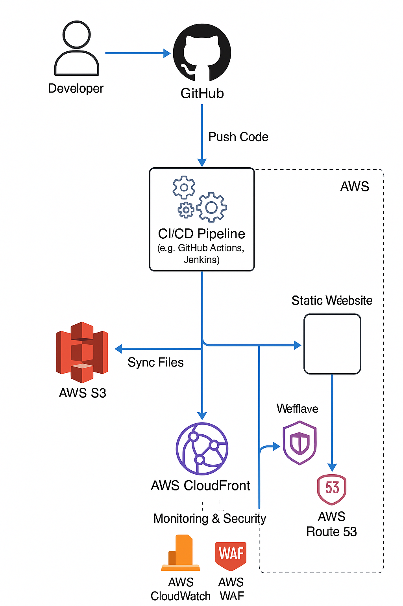

# Static Website Deployment

This project automates the deployment of a static website using AWS S3, Terraform, and GitHub Actions.

## 🚀 Features
- **Static Website** hosted on AWS S3
- **Infrastructure as Code** using Terraform
- **CI/CD Pipeline** with GitHub Actions
- **Public Access Policy** for website hosting
- **Monitoring & Security** using AWS CloudWatch and AWS WAF

## 📂 Project Structure
```
📂 static-website-deployment/
│── 📂 website/                  # Static website files
│   │── index.html               # Main HTML file
│── 📂 terraform/                # Terraform scripts
│   │── main.tf                  # S3 bucket and policies
│── 📂 .github/workflows/        # GitHub Actions CI/CD
│   │── deploy.yml               # Workflow for deployment
│── .gitignore                   # Ignore unnecessary files
│── README.md                    # Project documentation
```

## 🖼️ Architecture Diagram


## 🛠️ Setup and Deployment

### 1️⃣ Prerequisites
- AWS CLI configured with your credentials
- Terraform installed
- GitHub repository with Actions enabled

### 2️⃣ Deploy Using Terraform
```sh
cd terraform
terraform init
terraform apply -auto-approve
```

### 3️⃣ Setup GitHub Actions
- Add AWS credentials as GitHub Secrets:
  - `AWS_ACCESS_KEY_ID`
  - `AWS_SECRET_ACCESS_KEY`
- Push code to GitHub and the CI/CD pipeline will deploy the website automatically.

### 4️⃣ Monitoring & Security
- **AWS CloudWatch** is used to monitor S3 performance, CloudFront traffic, and CI/CD pipeline logs.
- **AWS WAF (Web Application Firewall)** provides protection against common web attacks.

### 5️⃣ Access the Website
- Open `http://my-static-website-ayush.s3-website-us-east-1.amazonaws.com` in your browser.

