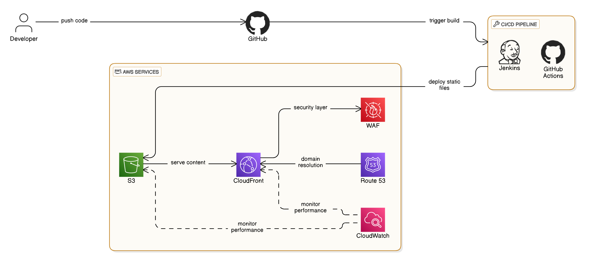

# Static Website Deployment with AWS

This project automates the deployment of a static website using **AWS S3, CloudFront, Route 53, AWS WAF, CloudWatch, and Terraform**, with a CI/CD pipeline managed by **GitHub Actions**.

## 🚀 Features
- **Static Website Hosting** on AWS S3
- **CloudFront CDN** for improved performance and HTTPS support
- **Route 53** for domain management
- **AWS WAF** to enhance security
- **CloudWatch** for monitoring website traffic
- **Terraform** for infrastructure as code (IaC)
- **CI/CD Pipeline** using GitHub Actions

## 📂 Project Structure
```
📂 static-website-deployment/
│── 📂 website/                  # Static website files
│   │── index.html               # Main HTML file
│── 📂 terraform/                # Terraform scripts
│   │── main.tf                  # Infrastructure setup
│── 📂 .github/workflows/        # GitHub Actions CI/CD
│   │── deploy.yml               # Workflow for deployment
│── .gitignore                   # Ignore unnecessary files
│── README.md                    # Project documentation
```

## 🖼️ Architecture Diagram


## 🛠️ Setup and Deployment

### 1️⃣ Prerequisites
- AWS CLI configured with your credentials
- Terraform installed
- GitHub repository with Actions enabled

### 2️⃣ Deploy Using Terraform
```sh
cd terraform
terraform init
terraform apply -auto-approve
```

### 3️⃣ Setup GitHub Actions
- Add AWS credentials as GitHub Secrets:
  - `AWS_ACCESS_KEY_ID`
  - `AWS_SECRET_ACCESS_KEY`
- Push code to GitHub, and the CI/CD pipeline will automatically deploy the website.

### 4️⃣ Access the Website
- The website will be available at **CloudFront's domain** or your custom **Route 53 domain**.
- Example: `https://my-static-website-[yourname].com